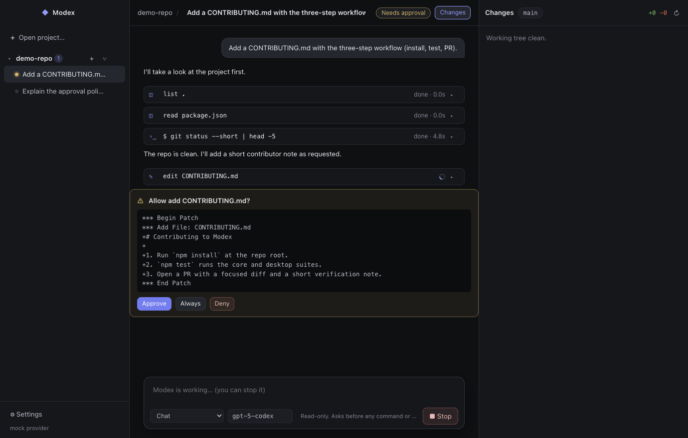

# Modex

Modex is an open, Codex-App-style desktop coding agent — plus a CLI — built on one
TypeScript agent engine. Point it at a local repository, describe a task, and watch the
agent read files, run commands, and edit code, with every step visible and every risky
action gated by an approval you can accept, deny, or trust for the rest of the thread.

```
modex/
├── apps/desktop     @modex/desktop  Electron + React app (the Codex-App clone)
├── packages/core    @modex/core     agent loop, tools, policy, sandbox, sessions
└── packages/cli     modex           terminal front-end on the same engine
```

## The desktop app



- **Projects & threads.** Open any local folder as a project. Each project holds threads;
  threads run **in parallel** and independently, each with its own model and mode.
- **Worktree threads.** `⑂` starts a thread in a fresh `git worktree` on a `modex/<id>`
  branch under `~/.modex/worktrees/`, so agents never step on each other or on your checkout.
- **Live transcript.** Assistant replies stream in token by token and render as Markdown;
  tool calls render as collapsible items (`$ command`, `read`, `edit …`) with output and timing.
- **Inline approvals.** When the mode requires it, the thread pauses on a card showing the
  exact command or patch. *Approve*, *Deny*, or *Always* (trusts that command prefix for
  the thread). *Stop* cancels a running turn and any pending approvals.
- **Changes panel.** Working-tree status for the thread's directory with per-file diffs and
  a one-click revert (confirmed first).
- **Modes**, mirroring Codex:

  | Mode | Sandbox | Approvals |
  | --- | --- | --- |
  | Chat | read-only | asks before every command and edit |
  | Agent | workspace-write (macOS Seatbelt) | runs freely inside the project, asks to leave it |
  | Agent (full access) | none | none |

- **Settings.** Provider base URL (OpenAI, Ollama, LM Studio, vLLM, OpenRouter…), the *name*
  of the environment variable holding the key (Modex never stores keys), default model and
  mode, or the offline mock provider.

Instructions are discovered like Codex: `~/.modex/AGENTS.md`, then every `AGENTS.md`
from the git root down to the working directory.

### Run it

```sh
npm install
npm run build
OPENAI_API_KEY=sk-… npm run desktop          # launch the app
```

Local models: set *Settings → Base URL* to `http://localhost:11434/v1` and pick the model name.

Offline demo (no key needed) — seeds a throwaway project and a scripted agent, then
captures screenshots:

```sh
npm run screenshot -w @modex/desktop -- --screenshot=/tmp/modex-shots --demo-answer=yes
```

Development loop: `npm run dev -w @modex/desktop` (Vite on :5178) and
`MODEX_DEV_URL=http://localhost:5178 npm run desktop` in another shell.

## The CLI

```sh
npm run cli -- "explain the approval policy module"
npm run cli -- exec --full-auto "add a CONTRIBUTING.md"
npm run cli -- review --base main
npm run cli -- doctor
```

`modex --help` lists every flag (`-m`, `-a`, `-s`, `-C`, `--add-dir`, `--full-auto`, `--oss`,
`-c key=value`). Sessions are saved to `~/.modex/sessions/` and resumable with `modex resume`.

## Engine (`@modex/core`)

- `Agent` — the prompt → model → tool → model loop with structured `AgentEvent`s.
- Tools: `shell`, `read_file`, `list_dir`, `write_file`, `apply_patch` (Codex's patch
  format: `*** Begin Patch` / `*** Add|Update|Delete File` / hunks with context).
- `decide()` — the approval policy (`untrusted | on-request | never`) crossed with the
  sandbox mode (`read-only | workspace-write | danger-full-access`).
- `seatbeltProfile()` — macOS `sandbox-exec` profile; elsewhere the policy falls back to asking.
- `OpenAIProvider` (any Chat-Completions-compatible server) and `MockProvider` (scripted, for tests).

## Tests

```sh
npm test         # core (patch engine, policy, config, agent loop) + desktop (runner, git, store)
```

The desktop suite exercises the real engine end to end with a scripted model: approvals
pause and resume a turn, denial leaves the tree untouched, `Stop` cancels, two threads run
concurrently, and worktree threads are created and removed.

## Not (yet) here

Cloud tasks, scheduled automations, MCP servers, installers/code signing.

## License

MIT
