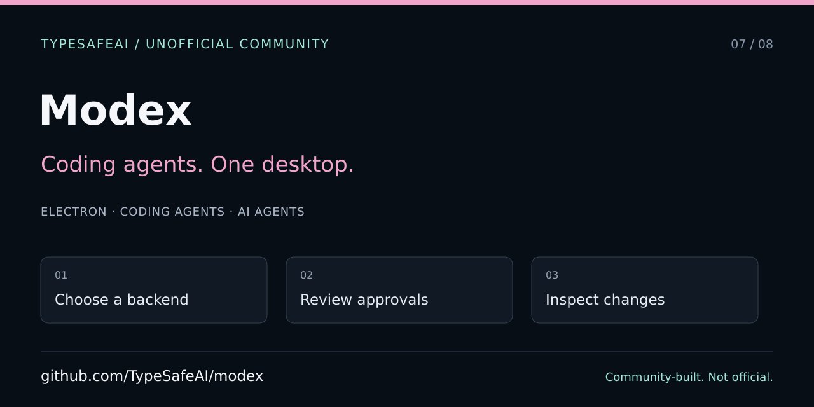

# Modex — developer and agent entry point

> Unofficial TypeSafeAI community project, not an official TypeSafe AI, OpenAI, or Anthropic desktop application. Community organization created by VC Moderator [@BunsDev](https://github.com/BunsDev).



[Setup and features](../../README.md) · [Agent instructions](../../AGENTS.md) · [Contributing](../../CONTRIBUTING.md) · [Screenshots](SCREENSHOTS.md)

## Start safely

Modex runs coding turns through installed Codex and Claude Code CLIs. Read the README for login and executable requirements. For development and documentation, use the offline mock engine; do not launch a real coding agent or approve an action merely to obtain a screenshot.

Use npm and the repository's worktree convention. `scripts/worktree.sh new <name>` creates an isolated checkout; the primary checkout stays on main. Follow AGENTS.md for signing, CI, and cleanup rather than sharing another session's branch.

## Project map

| Area | Responsibility |
| --- | --- |
| `apps/desktop/src/main` | Electron main process, CLI backends, execution coordination and approvals |
| `apps/desktop/src/renderer` | React desktop interface |
| `apps/desktop/src/main/engine/routing` | Optional Jev routing judge and heuristic fallback |
| `packages/core` | Offline scripted engine used for demos and tests |
| `apps/desktop/e2e` | Electron browser-driven tests |
| `scripts/worktree.sh` | Session isolation and cleanup convention |

Read [Auto routing](../auto-routing.md) before changing model selection. The optional Jev judge is separate from coding turns: CLI-only coding does not mean all optional features are network-free or credential-free. Never commit keys or include them in screenshot fixtures.

## Verification

```sh
npm run build
npm test
npm run test:e2e
```

Run the existing platform-appropriate suite, preserve the macOS CI gate, and report exactly which commands ran. Offline tests use scripted processes; they do not establish live-provider behavior or code-signing readiness. Do not bypass signing, approvals, sandboxes, or required checks for documentation work.

## Sharing

The SVG above is editable 1280×640 editorial artwork, not a screenshot. The [shared publishing checklist](https://github.com/TypeSafeAI/.github/blob/main/docs/discovery/SHARING.md) separates committed files, website metadata, and GitHub About/topics/Social preview settings. A committed manifest does not apply settings.

Use relevant descriptions such as local coding-agent desktop, CLI backends, worktrees, and approvals. Do not claim official affiliation, a new hosted runtime, universal model support, an available installer, or production safety without matching implementation evidence. Preserve the repository's MIT license and third-party attribution.
